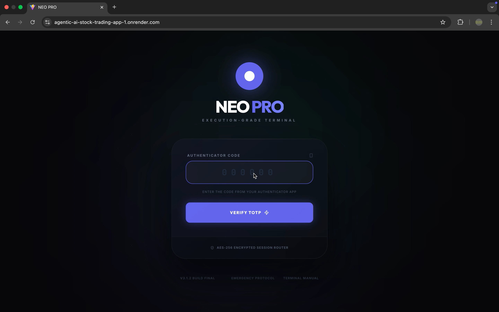
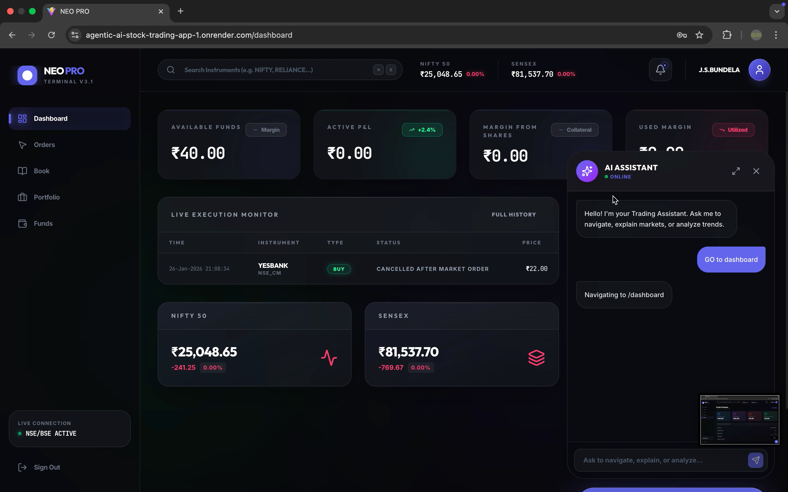
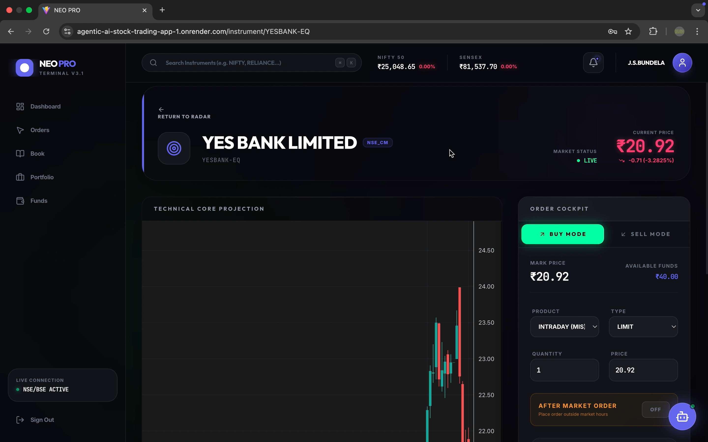
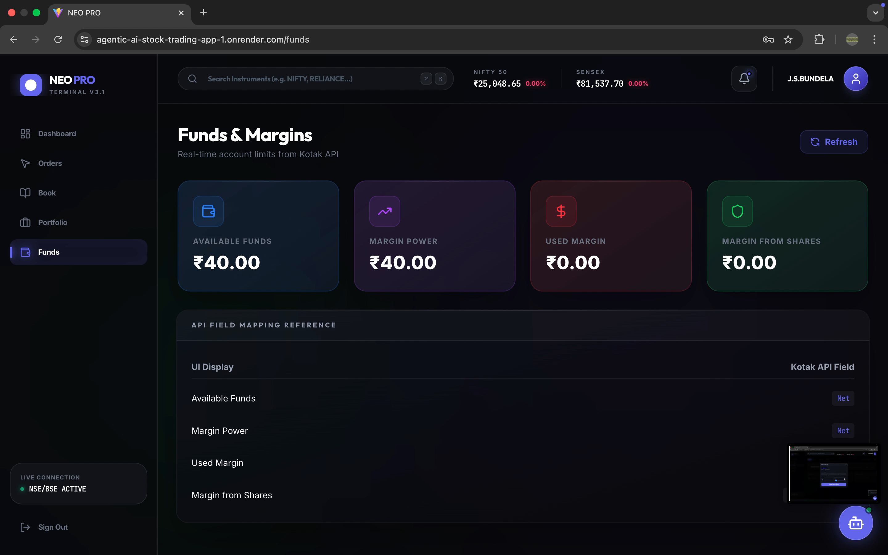
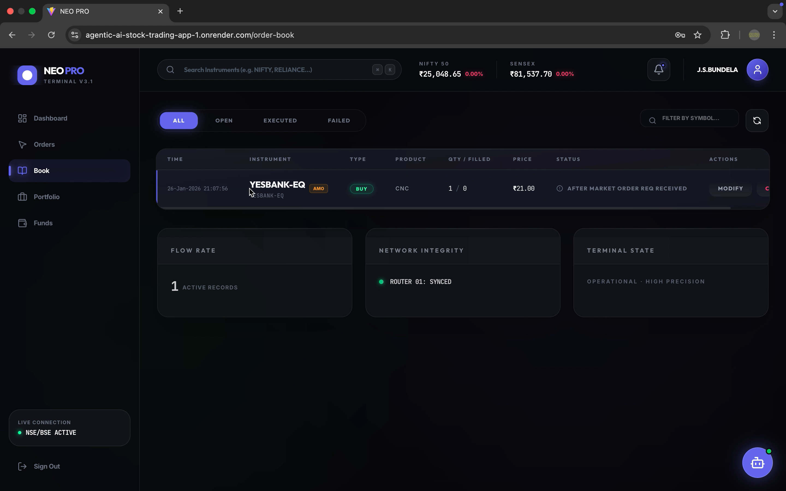
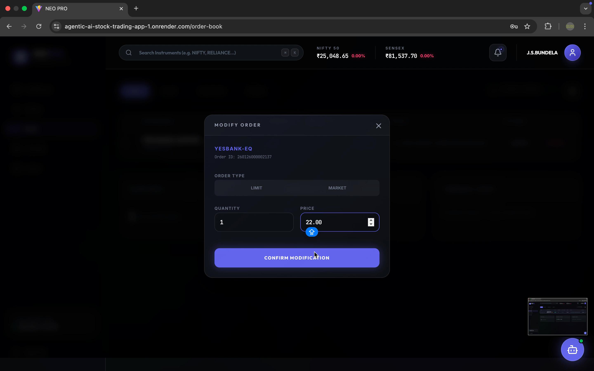
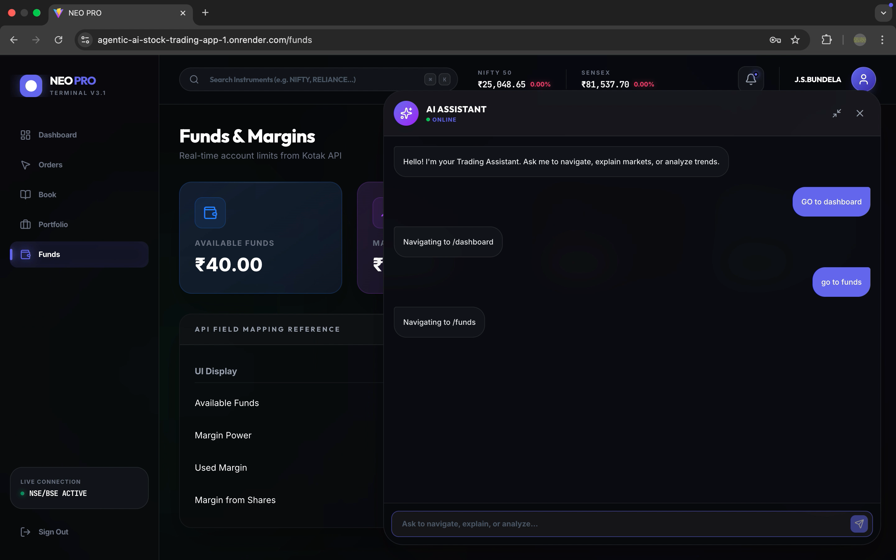
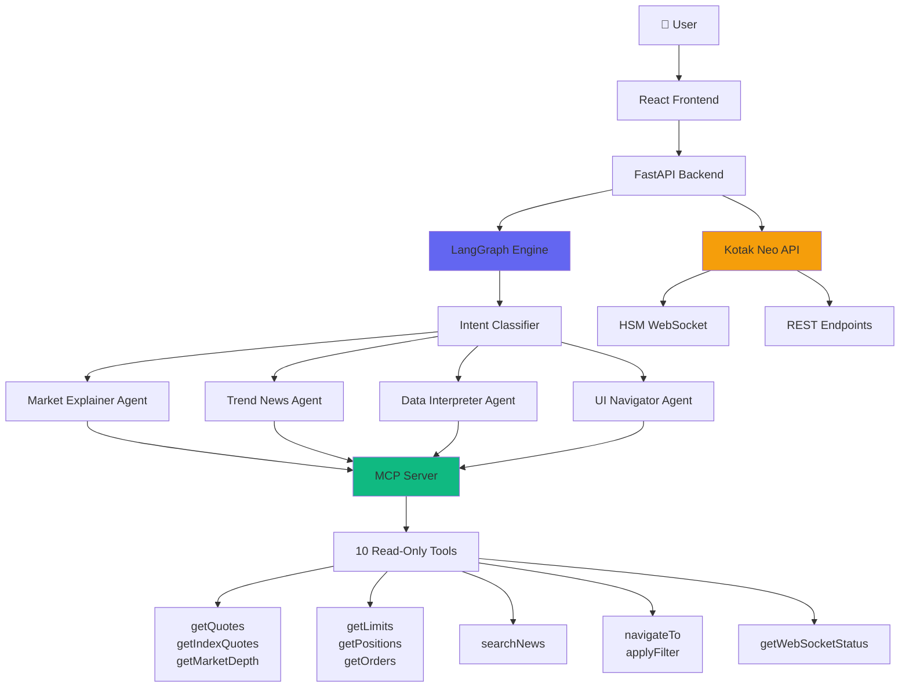
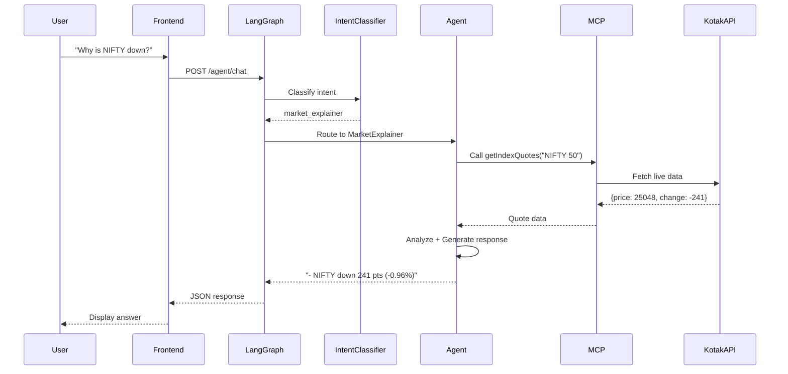

# 🤖 Agentic AI Stock Trading Platform

> **Trading platform with AI-powered market analysis using LangGraph & MCP (Model Context Protocol)**

[](https://python.org)
[](https://fastapi.tiangolo.com)
[](https://reactjs.org)
[](https://www.typescriptlang.org)
[](LICENSE)

A full-stack trading application integrating **Kotak Neo API** with an **intelligent multi-agent system** powered by LangGraph for market analysis, news aggregation, and trading education.

---

[](./docs/demo.mov)

*Click the badge above to download/watch the application demo video.*

**Screenshots**:

| Login | Dashboard |
|:---:|:---:|
|  |  |

| Trading | Funds |
|:---:|:---:|
|  |  |

| Orders | Order Modification |
|:---:|:---:|
|  |  |



---

## ✨ Key Features

### 🧠 **AI-Powered Agent System**
- **Market Explainer**: Real-time market analysis with live data
- **Trend News Analyst**: News aggregation and summarization  
- **Data Interpreter**: Trading education and concept explanations
- **UI Navigator**: Voice-like navigation commands

### 📊 **Trading Platform**
- Real-time market quotes (NIFTY, SENSEX, stocks)
- Live WebSocket feeds for price updates
- Portfolio management (holdings, positions, P&L)
- Order placement and management
- Funds and margin tracking

### 🔒 **Safety First**
- **NO trading recommendations** - agents never suggest buy/sell
- Read-only operations for AI agents
- All trading actions require explicit user confirmation
- Comprehensive audit logging

---

## 🏗️ Architecture

### System Overview



### Agent Workflow



---

## 🛠️ Technology Stack

### Backend
- **Framework**: FastAPI (Python 3.12)
- **AI Engine**: LangGraph + **Groq (Llama 3.3 70B)**
- **Agent Architecture**: Hybrid (LLM + Deterministic Rules)
- **Agent System**: MCP (Model Context Protocol)
- **Database**: SQLite (with async support)
- **WebSocket**: Kotak HSM Protocol
- **Search**: DuckDuckGo News API

### Frontend
- **Framework**: React 18 + TypeScript
- **Build Tool**: Vite
- **Styling**: Tailwind CSS
- **Routing**: React Router v6
- **Animations**: Framer Motion
- **State**: React Hooks + Context

### Infrastructure
- **API Integration**: Kotak Neo Trade API
- **Authentication**: TOTP + MPIN
- **Logging**: Structured JSON logs
- **Testing**: Comprehensive test suite

---

## 📦 Installation

### Prerequisites

- Python 3.12+
- Node.js 18+
- Kotak Neo API Credentials
- **Groq API Key** (Free)

### 1. Clone Repository

```bash
git clone https://github.com/yourusername/agentic-ai-stock-trading-app.git
cd agentic-ai-stock-trading-app
```

### 2. Backend Setup

```bash
# Create virtual environment
python3 -m venv .venv
source .venv/bin/activate  # On Windows: .venv\Scripts\activate

# Install dependencies
cd backend
pip install -r requirements.txt

# Configure environment
cp .env.example .env
# Edit .env with your credentials:
# - KOTAK_ACCESS_TOKEN
# - MOBILE_NUMBER
# - UCC (Client Code)
# - MPIN
# - OPENROUTER_API_KEY
```

### 3. Frontend Setup

```bash
cd ../frontend
npm install

# Configure API endpoint (if needed)
# Edit src/api/client.ts
```

### 4. Run Application

**Terminal 1 - Backend**:
```bash
cd backend
uvicorn app.main:app --reload --port 8000
```

**Terminal 2 - Frontend**:
```bash
cd frontend
npm run dev
```

**Access**:
- Frontend: http://localhost:5173
- Backend API: http://localhost:8000
- API Docs: http://localhost:8000/docs

---

## 🎯 Usage

### AI Agent Examples

#### Market Analysis
```
User: "Why is NIFTY down today?"
Agent: 
- NIFTY 50 down 241.25 points (-0.96%), bearish trend
- Trading near day's low at 25,048  
- Weakness across sectors, financials leading decline
```

#### News Updates
```
User: "Latest stock market news"
Agent:
- Markets decline 2% on global concerns (Reuters)
- IT sector leads losses, down 3.5%
- Banking stocks hold steady amid volatility
```

#### Navigation
```
User: "Go to portfolio"
Agent: [Routes to /portfolio page]
```

#### Education
```
User: "What is a limit order?"
Agent:
- Order to buy/sell at specific price or better
- Not guaranteed to execute (price may not reach limit)
- Gives trader control over execution price
```

### Trading Operations

1. **Login**: TOTP + MPIN authentication
2. **View Dashboard**: Real-time portfolio and market data
3. **Place Orders**: Search stock → Set price/quantity → Confirm
4. **Monitor**: Live P&L tracking, order status updates
5. **AI Assistant**: Ask questions anytime via chat interface

---

## 📁 Project Structure

```
agentic-ai-stock-trading-app/
├── backend/
│   ├── app/
│   │   ├── agents/           # AI Agent system
│   │   │   ├── langgraph_engine.py    # LangGraph orchestration
│   │   │   ├── market_explainer.py    # Market analysis agent
│   │   │   ├── trend_news_agent.py    # News aggregation agent
│   │   │   ├── data_interpreter.py    # Education agent
│   │   │   └── ui_navigator.py        # Navigation agent
│   │   ├── mcp/              # Model Context Protocol tools
│   │   │   ├── mcp_server.py          # MCP orchestrator
│   │   │   ├── mcp_tools.py           # 10 read-only tools
│   │   │   └── mcp_logger.py          # Tool call logging
│   │   ├── auth/             # Authentication
│   │   ├── market/           # Market data services
│   │   ├── orders/           # Order management
│   │   ├── portfolio/        # Portfolio services
│   │   └── database/         # Database models
│   ├── logs/                 # Application logs
│   └── requirements.txt
│
├── frontend/
│   ├── src/
│   │   ├── components/       # Reusable UI components
│   │   ├── pages/            # Page components
│   │   ├── services/         # API clients
│   │   ├── hooks/            # Custom React hooks
│   │   └── utils/            # Helper functions
│   ├── public/
│   └── package.json
│
└── README.md
```

---

## 🔧 Configuration

### Environment Variables

**Backend (.env)**:
```env
# Kotak Neo API
KOTAK_ACCESS_TOKEN=your_access_token
MOBILE_NUMBER=9876543210
UCC=your_client_code
MPIN=your_6_digit_mpin

# AI/ML (Groq)
GROQ_API_KEY=your_groq_api_key

# Database
DATABASE_URL=sqlite:///./trading.db

# Logging
LOG_LEVEL=INFO
```

**Frontend (optional)**:
```env
VITE_API_URL=http://localhost:8000
```

---

## 🧪 Testing

### Run Agent Tests
```bash
cd backend
./test_agents_advanced.sh
```

**Tests include**:
- Intent classification accuracy
- MCP tool functionality
- Safety constraint enforcement
- Response format validation

### Manual Testing Checklist
- [ ] Login with TOTP + MPIN
- [ ] View live market data
- [ ] Place test order
- [ ] Check portfolio
- [ ] Ask AI agent questions
- [ ] Test navigation commands

---

## 🔐 Security

### Agent Safety Constraints
- **NO trading recommendations**: Agents never suggest buy/sell
- **Read-only MCP tools**: Cannot place orders or modify portfolio
- **Audit logging**: All agent actions logged (mcp_tool_calls.log)
- **Intent classification**: Queries validated before routing

### API Security
- Environment-based credentials (never hardcoded)
- Session management with token refresh
- HTTPS recommended for production
- Rate limiting on endpoints

---

## 📊 MCP Tools Reference

| Tool | Description | Returns |
|:---|:---|:---|
| `getQuotes` | Fetch real-time stock quotes | Price, change, volume |
| `getIndexQuotes` | Get index data (NIFTY, SENSEX) | LTP, day change, % change |
| `getMarketDepth` | Order book depth | Bids, asks, quantities |
| `getLimits` | Account funds and margins | Cash, collateral, used margin |
| `getPositions` | Open positions (intraday) | Qty, P&L, average price |
| `getOrders` | Order history | Status, price, filled qty |
| `getWebSocketStatus` | Check WS connection | Connected, subscribed symbols |
| `searchNews` | Search market news | Titles, snippets, sources |
| `navigateTo` | Navigate UI | Route instructions |
| `applyFilter` | Filter data views | Filter configuration |

---

## 🚀 Deployment

### Production Checklist
1. Set `LOG_LEVEL=ERROR` in production
2. Use HTTPS for frontend/backend
3. Configure CORS for your domain
4. Set up rate limiting
5. Enable production build frontend:
   ```bash
   npm run build
   ```
6. Use production ASGI server (not uvicorn --reload)

### Recommended Stack
- **Frontend**: Vercel / Netlify
- **Backend**: AWS EC2 / DigitalOcean
- **Database**: PostgreSQL (replace SQLite)
- **Monitoring**: Sentry, LogRocket

---

## 🤝 Contributing

Contributions welcome! Please:
1. Fork the repository
2. Create feature branch (`git checkout -b feature/AmazingFeature`)
3. Commit changes (`git commit -m 'Add AmazingFeature'`)
4. Push to branch (`git push origin feature/AmazingFeature`)
5. Open Pull Request

---

## 📝 License

This project is licensed under the MIT License - see [LICENSE](LICENSE) file.

---

## 🙏 Acknowledgments

- **Kotak Neo** for trading API
- **LangChain/LangGraph** for agent orchestration
- **OpenRouter** for LLM access
- **FastAPI** for backend framework
- **React** for frontend framework

---

## 📞 Support

For issues and questions:
- 📧 Email: your.email@example.com
- 🐛 Issues: [GitHub Issues](https://github.com/JSBundela/repo/issues)
- 📖 Docs: [Full Documentation](./docs/README.md)

---

**⚠️ Disclaimer**: This software is for educational purposes. Trading involves risk. Always do your own research and never invest more than you can afford to lose. The AI agents do NOT provide financial advice.

---

Made with ❤️ by JSBundela
